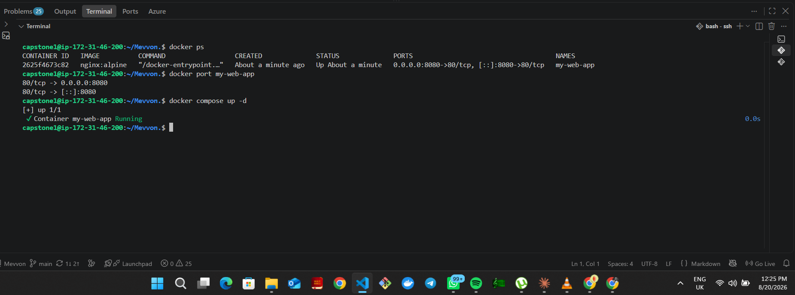
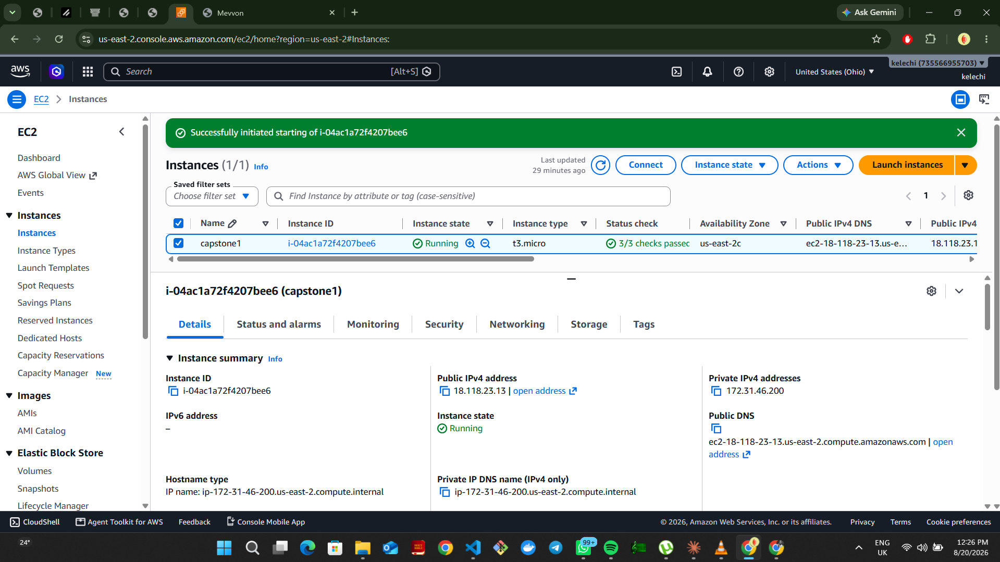
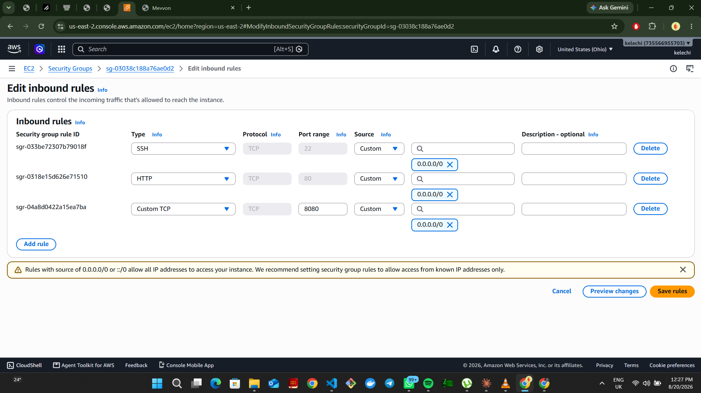

# Static Site on Docker + EC2

A static HTML website, containerized with Nginx and deployed on an AWS EC2 instance using Docker Compose.

## Overview

This project takes a static site (HTML/CSS/JS) and serves it through an Nginx container running in Docker on an EC2 instance. The goal was hands-on practice with containerization and cloud deployment: building a lightweight image, running it via Compose, and getting it live on a public instance.

## Architecture

```
Browser --> EC2 Public IP:8080 --> Docker (nginx:alpine container) --> /src (static files)
```

- **Web server:** Nginx (`nginx:alpine`) — chosen for its small image size and fast startup compared to heavier web server images.
- **Orchestration:** Docker Compose, managing the single `app` service.
- **Host:** AWS EC2 instance running Docker.
- **Content:** Static files mounted read-only into the container from `./src`.

## Project Structure

```
.
├── docker-compose.yaml
├── src/                # static site files (HTML, CSS, JS, assets)
└── README.md
```

## docker-compose.yaml

```yaml
services:
  app:
    image: nginx:alpine
    container_name: my-web-app
    restart: unless-stopped
    volumes:
      - ./src:/usr/share/nginx/html:ro
    ports:
      - "8080:80"
```

Key decisions:
- **Volume mount instead of `COPY`:** static files live in `./src` and are mounted read-only into Nginx's default web root. This keeps the image generic (no custom build needed) and makes updating content a matter of replacing files rather than rebuilding.
- **`restart: unless-stopped`:** ensures the container comes back up automatically after a reboot or crash, without restarting if it was intentionally stopped.
- **Port mapping `8080:80`:** exposes the site on port 8080 on the host, leaving 80 free for a future reverse proxy or load balancer.

## Screenshots

**Container running with correct port mapping**
`docker ps` / `docker port` confirming the Nginx container is up and 8080 maps to container port 80.



**Live site**
The site loaded in the browser via the EC2 instance's public IP on port 8080.


**EC2 instance**
The instance running in the AWS Console (t3.micro, us-east-2).



**Security group rules**
Inbound rules allowing SSH (22), HTTP (80), and the app port (8080).



## Deployment Steps

1. **Provision an EC2 instance** (t2.micro/t3.micro, free-tier eligible) with a security group allowing inbound traffic on port 8080 (and 22 for SSH).
2. **Install Docker and Docker Compose** on the instance:
   ```bash
   sudo yum install docker -y
   sudo systemctl start docker
   sudo systemctl enable docker
   sudo usermod -aG docker $USER
   ```
3. **Copy the project to the instance** (via `scp` or `git clone`).
4. **Start the container:**
   ```bash
   docker compose up -d
   ```
5. **Verify:** visit `http://<EC2-public-IP>:8080` in a browser.

## Running Locally

```bash
docker compose up -d
```

Then open `http://localhost:8080`.

## Future Improvements

- Put the site behind an Application Load Balancer or Nginx reverse proxy with TLS (port 443).
- Add a CI/CD pipeline (GitHub Actions) to build and redeploy on push.
- Move image build into a proper Dockerfile if the site grows beyond static file serving (e.g. templating, custom Nginx config for caching/gzip).
- Use Terraform to provision the EC2 instance and security group instead of manual setup.

## What This Demonstrates

Basic containerization of a static asset, use of Docker Compose for service definition, and manual deployment to a cloud VM — foundational steps before layering on IaC, CI/CD, and orchestration.

